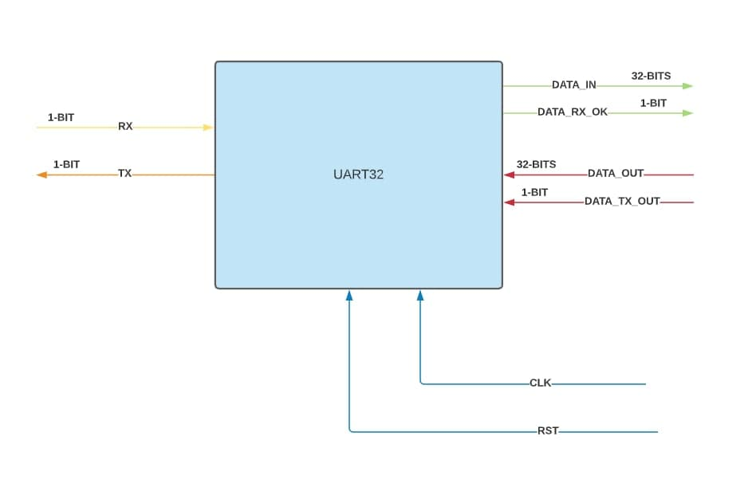

# UART32
 This is the 32-bits protocol based on UART (VHDL)

## [Code](Code)
This folder contains the protocol files 

## [Receiver](Receiver)
This file contains the Vivado project for the receiver

## [Transmitter](Transmitter)
This file contains the Vivado project for the transmitter
